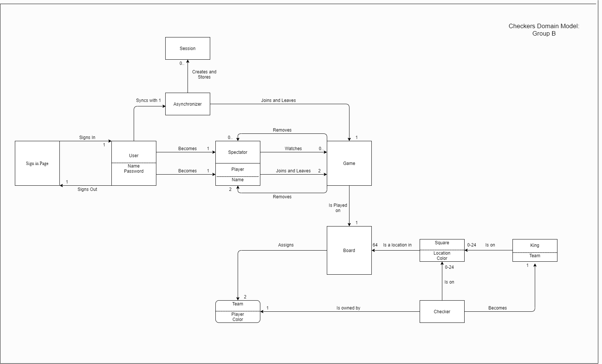
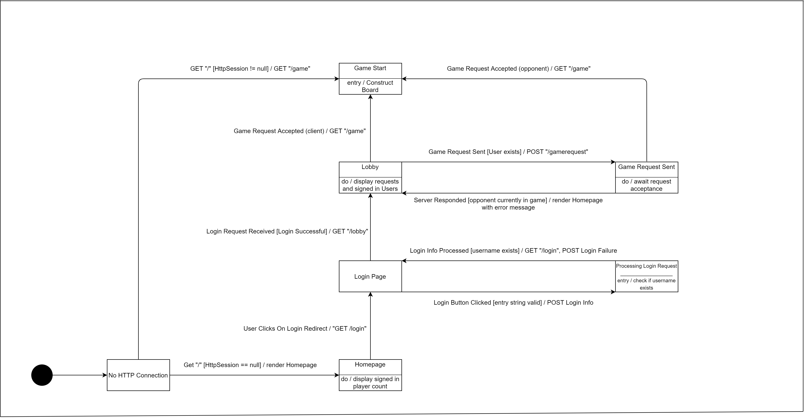

# PROJECT Design Documentation

## Team Information
* Team name: 04b
* Team members
  * Triston Lincoln
  * Carlos Hargrove
  * Michael Ambrose
  * Cody Smith

## Executive Summary

This is a summary of the project.

### Purpose
The goal of this project is to create an application that allows players to play each other in a web based version of American Checkers. This application will include the ability to spectate games and play asynchronus games.

### Glossary and Acronyms
| Term |      Definition        |
|------|------------------------|
| VO   |     Value Object       |
| MVP  | Minimum Viable Product |

## Requirements

This section describes the features of the application.

### Definition of MVP
The MVP of this application allows many different players to log-in and play American Checkers against others.

### MVP Features
For this application's MVP, a user should be able to 
- sign-in with a unique username 
- sign-out when they are finished playing 
- choose a player to play checkers against and provided they are available to play, they should be able to play a game of checkers against them

The game of checkers should be based of the American rules which includes 
- the ability to perform basic piece movement
- perform double jumps
- obtain king pieces

A game is lost when 
- the player loses all of their pieces. 
- the player resigns from a game.

### Roadmap of Enhancements
- Spectator mode: Will allow a player who is not in a game to spectate two other players who are playing a game
- Asynchronous mode: Will allow a player to start an asynchrous game, where they can leave and come back once their opponent has made a move

## Application Domain

This section describes the application domain.

_Program opens to a home page that has 2 forms. When not signed in it details information about the site and allows the 
user to sign in. If they choose to sign in they'll be brought to a page where they can enter a Username. Upon creating a 
unique profile they will gain access to signed in form of the home page and be directed back. This displays a list of all 
users. If a player is press who is not in a game a request to play a game will be sent. If both players agree to the request
they will both be taken to the game itself. Which is just an HTML representation of a game of checkers. Players can quit 
at any time to find a new game or sign out._

## Architecture and Design

This section describes the application architecture.

### Summary

The following Tiers/Layers model shows a high-level view of the webapp's architecture.

As a web application, the user interacts with the system using a
browser.  The client-side of the UI is composed of HTML pages with
some minimal CSS for styling the page.  There is also some JavaScript
that has been provided to the team by the architect.

The server-side tiers include the UI Tier that is composed of UI Controllers and Views.
Controllers are built using the Spark framework and View are built using the FreeMarker framework.  The Application and Model tiers are built using plain-old Java objects (POJOs).

Details of the components within these tiers are supplied below.

### Overview of User Interface

This section describes the web interface flow; this is how the user views and interacts
with the WebCheckers application.

_The user will connect to the home page. From there they will be encouraged to log in to access the rest of the website's
functions. Once logged in they will be sent back to the home page and will be able to interact with other users. When 
they interact with another user a challenge will be sent out. If both players accept a game will begin. From there both 
users will have their side of the board visible on the bottom, and their opponent's on the top. From their they can play
out the whole match and leave if they so desire which would take them back to the home page. The home page also has a log
out button to return them into a pre-logged in state._

### UI Tier
> _Provide a summary of the Server-side UI tier of your architecture.
> Describe the types of components in the tier and describe their
> responsibilities.  This should be a narrative description, i.e. it has
> a flow or "story line" that the reader can follow._

> _At appropriate places as part of this narrative provide one or more
> static models (UML class structure or object diagrams) with some
> details such as critical attributes and methods._

> _You must also provide any dynamic models, such as statechart and
> sequence diagrams, as is relevant to a particular aspect of the design
> that you are describing.  For example, in WebCheckers you might create
> a sequence diagram of the `POST /validateMove` HTTP request processing
> or you might show a statechart diagram if the Game component uses a
> state machine to manage the game._

> _If a dynamic model, such as a statechart describes a feature that is
> not mostly in this tier and cuts across multiple tiers, you can
> consider placing the narrative description of that feature in a
> separate section for describing significant features. Place this after
> you describe the design of the three tiers._

### Application Tier
> _Provide a summary of the Application tier of your architecture. This
> section will follow the same instructions that are given for the UI
> Tier above._

### Model Tier
> _Provide a summary of the Application tier of your architecture. This
> section will follow the same instructions that are given for the UI
> Tier above._

### Design Improvements
> _Discuss design improvements that you would make if the project were
> to continue. These improvement should be based on your direct
> analysis of where there are problems in the code base which could be
> addressed with design changes, and describe those suggested design
> improvements. After completion of the Code metrics exercise, you
> will also discuss the resutling metric measurements.  Indicate the
> hot spots the metrics identified in your code base, and your
> suggested design improvements to address those hot spots._

## Testing
> _This section will provide information about the testing performed
> and the results of the testing._

### Acceptance Testing
> _Report on the number of user stories that have passed all their
> acceptance criteria tests, the number that have some acceptance
> criteria tests failing, and the number of user stories that
> have not had any testing yet. Highlight the issues found during
> acceptance testing and if there are any concerns._

### Unit Testing and Code Coverage
> _Discuss your unit testing strategy. Report on the code coverage
> achieved from unit testing of the code base. Discuss the team's
> coverage targets, why you selected those values, and how well your
> code coverage met your targets. If there are any anomalies, discuss
> those._
